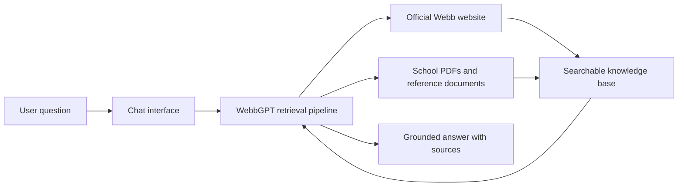

# Submission

> AI Design Challenge Submission Document

WebbGPT is a school-specific AI assistant for The Webb Schools that helps users get relevant answers quickly from official school information. In its current form, it brings together content from Webb's public website and key school documents, then turns that information into a chat experience that is faster and easier to use than manually searching through pages, PDFs, and policies. The result is a practical tool that can answer questions about admissions, academics, student life, policies, schedules, athletics, and other common topics in a way that feels accessible to prospective families, current students, and parents.

This document was written with AI assistance. Ideas are my own.

## How It Works

At a high level, WebbGPT uses a [retrieval-augmented generation (RAG)](https://aws.amazon.com/what-is/retrieval-augmented-generation/) workflow: school information is collected from approved sources, processed into searchable chunks, stored in a vector database, and then retrieved when a user asks a question. The system searches for the most relevant passages, sends those passages to the language model as context, and generates an answer grounded in the source material rather than relying on general memory alone. This makes the assistant more useful for school-specific questions and helps keep answers tied to real Webb documents.

For a deeper technical breakdown of the current implementation, see the [README](../README.md).

## Project Value

WebbGPT already has clear practical value as an admissions and communications tool. For prospective students and families, it can serve as a promotional and informational front door to the school by making it easier to explore programs, policies, campus life, and institutional details without digging through many different pages. For current students, it works as a quick point of reference for questions that often come up in day-to-day school life, from course information to handbook rules to schedule-related details. For parents, especially those trying to clarify school processes or locate the right information quickly, it can reduce friction and make school information easier to access in a more conversational format.

The most important value of the project, however, is its scalability. WebbGPT is not only a chatbot for the current document set; it is a framework for unifying school information that is otherwise scattered across separate systems. With the right permissions and privacy safeguards, the same interface could be extended to connect to additional sources such as Canvas LMS, Blackbaud and related school systems for grades, forms, and administrative workflows, school email updates, calendars, and other internal information channels. That means the long-term value is not just better answers from today's documents, but a scalable way to surface the right information from many sources through one simple experience.

This scalability is in part demonstrated by my work with OpenClaw. While it is certainly not a guarantee that some API call an LLM generates on the fly will translate to working in this app, it is probably significantly more likely than not that it will translate rather easily. For example, I have set up a job to run at 7:40 pm that takes all my assignments and grades from Canvas, feeds them through an LLM, who compares those things to its memory of my previous submissions assignments and grades and sends me some relevant briefing information including if any grades went up or down and what I have due tomorrow/this week. This is one of many. It is not also restricted to run at any certain time to do any specific thing, which may have been a restriction of some systems of the past. My point here is that it isn't really hard to chuck more and different kinds of sources into this kind of system; or at least it is extremely disproportionally more useful than difficult.

In that sense, WebbGPT is fundamentally a time-saving tool. Its purpose is to reduce the effort required to find relevant information, clarify uncertainty quickly, and make school knowledge more usable for the people who need it. Whether the user is a prospective applicant exploring Webb, a student trying to verify a policy, or a parent looking for a clear answer, the core value is the same: faster access to relevant information with less friction.